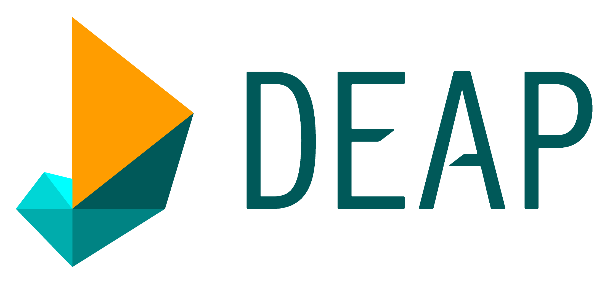

<h1 align="center">Logan Thomas</h1>
<h3 align="center">Software Engineer | Technical Trainer | Python Enthusiast</h3>

<!--

  
  
  
  

-->

Hi, I'm Logan — a data science software engineer at [Fullstory](https://www.fullstory.com/). I've previously worked on software for pathogen identification and antibiotic testing at Pattern Bioscience, taught Python at Enthought, built ML tools for protective design at Protective Engeineerinig Consultants, and developed data science solutions at Nielsen.

I'm passionate about software, data science, machine learning, and sharing what I learn. You’ll find some of my projects and experiments here on GitHub. Feel free to check out my [personal website](https://www.loganthomas.dev/) for more detailed write-ups.

Thanks for visiting!

## Areas of Expertise
- Python
- Data Science
- Machine Learning
- Teaching & Mentoring

## Top Programming Languages Used

<!-- See https://github.com/anuraghazra/github-readme-stats?tab=readme-ov-file#showing-icons -->
## GitHub Activity

<!--
## Technologies & Programming Languages
### Contributions

  
  
  
  
  
  
  
  
  
  
  
  
  

-->

## Open-source contributions

*Click the badges to see details!*
<!--  -->
<!-- Copy this line and replace with number and link text -->
<!-- | [LINKTEXT][reX]        | [![issues][ibX]][ilX]   | [![pulls][pbX]][plX] | -->

| Project                                                                                        | Issues                  | Pull requests        |
| :--------------------------------------------------------------------------------------------- | :---------------------- | :------------------- |
|  [pyjanitor][re9] | [![issues][ib9]][il9]   | [![pulls][pb9]][pl9] |
|  [PyTorch (Tutorials)][re2]          | [![issues][ib2]][il2]   | [![pulls][pb2]][pl2] |
|  [PyTorch][re1]                      | [![issues][ib1]][il1]   | [![pulls][pb1]][pl1] |
|  [SciPy Conference][re5] | [![issues][ib5]][il5]   | [![pulls][pb5]][pl5] |
|  [Cubyc][re8] | [![issues][ib8]][il8]   | [![pulls][pb8]][pl8] |
|  [DEAP][re10] | [![issues][ib10]][il10]   | [![pulls][pb10]][pl10] |
|  [NumPy][re3]                            | [![issues][ib3]][il3]   | [![pulls][pb3]][pl3] |
|  [scikit-learn][re6] | [![issues][ib6]][il6]   | [![pulls][pb6]][pl6] |
|  [SciPy][re4]                       | [![issues][ib4]][il4]   | [![pulls][pb4]][pl4] |
|  [Xarray][re7] | [![issues][ib7]][il7]   | [![pulls][pb7]][pl7] |
|  [Pint][re11] | [![issues][ib11]][il11]   | [![pulls][pb11]][pl11] |
|  [DataCamp](https://www.datacamp.com/courses/writing-efficient-python-code) |    |  |

<!---------------------------------------------------------------------------->
<!-- Reference-style linking in Markdown (https://www.markdownguide.org/basic-syntax/#reference-style-links) -->
<!-- Only way to have a link that isn't the badge and goes to the location in GitHub -->
<!-- Can't use a table because the link gets stripped out. Also above markdown is easier to read -->
<!-- So that's an additional advatnage of doing the above flow -->

<!-- 're' == repo url -->
<!-- 'ib' == issue badge url -->
<!-- 'il' == issue url  -->
<!-- 'pb' == pull request badge url -->
<!-- 'pl' == pull request url -->

<!-- https://shields.io/badges/dynamic-json-badge -->
<!-- issue url: https://api.github.com/search/issues?q=repo:USER/REPO+is:issue+involves:loganthomas  -->
<!-- pull url: https://api.github.com/search/issues?q=repo:USER/REPO+is:pr+involves:loganthomas  -->
<!-- style: flat -->
<!-- query: $.total_count -->

<!-- Note that this could be automated by going to the following endpoint: -->
<!-- https://api.github.com/search/issues?q=involves:loganthomas -->
<!-- but then that would require some processing to extract the relevant information -->
<!-- and then construct the README -->

<!-- Template that we can copy and CTRL+F replace 'TEXT', 'USER', and 'REPO' -->
[reX]: https://github.com/USER/REPO "TEXT"
[ibX]: https://img.shields.io/badge/dynamic/json?url=https%3A%2F%2Fapi.github.com%2Fsearch%2Fissues%3Fq%3Drepo%3AUSER%2FREPO%2Bis%3Aissue%2Binvolves%3Aloganthomas&query=%24.total_count&style=flat&label=issues
[ilX]: https://github.com/USER/REPO/issues?q=is:issue+involves:loganthomas
[pbX]: https://img.shields.io/badge/dynamic/json?url=https%3A%2F%2Fapi.github.com%2Fsearch%2Fissues%3Fq%3Drepo%3AUSER%2FREPO%2Bis%3Apr%2Binvolves%3Aloganthomas&query=%24.total_count&style=flat&label=pulls&color=orange
[plX]: https://github.com/USER/REPO/issues?q=is:pr+involves:loganthomas

<!---------------------------------------------------------------------------->
<!---------------------------------------------------------------------------->
<!---------------------------------------------------------------------------->
<!---------------------------------------------------------------------------->

[re1]: https://github.com/pytorch/pytorch "PyTorch"
[ib1]: https://img.shields.io/badge/dynamic/json?url=https%3A%2F%2Fapi.github.com%2Fsearch%2Fissues%3Fq%3Drepo%3Apytorch%2Fpytorch%2Bis%3Aissue%2Binvolves%3Aloganthomas&query=%24.total_count&style=flat&label=issues
[il1]: https://github.com/pytorch/pytorch/issues?q=is:issue+involves:loganthomas
[pb1]: https://img.shields.io/badge/dynamic/json?url=https%3A%2F%2Fapi.github.com%2Fsearch%2Fissues%3Fq%3Drepo%3Apytorch%2Fpytorch%2Bis%3Apr%2Binvolves%3Aloganthomas&query=%24.total_count&style=flat&label=pulls&color=orange
[pl1]: https://github.com/pytorch/pytorch/issues?q=is:pr+involves:loganthomas

[re2]: https://github.com/pytorch/tutorials "PyTorch (Tutorials)"
[ib2]: https://img.shields.io/badge/dynamic/json?url=https%3A%2F%2Fapi.github.com%2Fsearch%2Fissues%3Fq%3Drepo%3Apytorch%2Ftutorials%2Bis%3Aissue%2Binvolves%3Aloganthomas&query=%24.total_count&style=flat&label=issues
[il2]: https://github.com/pytorch/tutorials/issues?q=is:issue+involves:loganthomas
[pb2]: https://img.shields.io/badge/dynamic/json?url=https%3A%2F%2Fapi.github.com%2Fsearch%2Fissues%3Fq%3Drepo%3Apytorch%2Ftutorials%2Bis%3Apr%2Binvolves%3Aloganthomas&query=%24.total_count&style=flat&label=pulls&color=orange
[pl2]: https://github.com/pytorch/tutorials/issues?q=is:pr+involves:loganthomas

[re3]: https://github.com/numpy/numpy "NumPy"
[ib3]: https://img.shields.io/badge/dynamic/json?url=https%3A%2F%2Fapi.github.com%2Fsearch%2Fissues%3Fq%3Drepo%3Anumpy%2Fnumpy%2Bis%3Aissue%2Binvolves%3Aloganthomas&query=%24.total_count&style=flat&label=issues
[il3]: https://github.com/numpy/numpy/issues?q=is:issue+involves:loganthomas
[pb3]: https://img.shields.io/badge/dynamic/json?url=https%3A%2F%2Fapi.github.com%2Fsearch%2Fissues%3Fq%3Drepo%3Anumpy%2Fnumpy%2Bis%3Apr%2Binvolves%3Aloganthomas&query=%24.total_count&style=flat&label=pulls&color=orange
[pl3]: https://github.com/numpy/numpy/issues?q=is:pr+involves:loganthomas

[re4]: https://github.com/scipy/scipy "SciPy"
[ib4]: https://img.shields.io/badge/dynamic/json?url=https%3A%2F%2Fapi.github.com%2Fsearch%2Fissues%3Fq%3Drepo%3Ascipy%2Fscipy%2Bis%3Aissue%2Binvolves%3Aloganthomas&query=%24.total_count&style=flat&label=issues
[il4]: https://github.com/scipy/scipy/issues?q=is:issue+involves:loganthomas
[pb4]: https://img.shields.io/badge/dynamic/json?url=https%3A%2F%2Fapi.github.com%2Fsearch%2Fissues%3Fq%3Drepo%3Ascipy%2Fscipy%2Bis%3Apr%2Binvolves%3Aloganthomas&query=%24.total_count&style=flat&label=pulls&color=orange
[pl4]: https://github.com/scipy/scipy/issues?q=is:pr+involves:loganthomas

[re5]: https://github.com/scipy-conference/scipy-conference "SciPy Conference"
[ib5]: https://img.shields.io/badge/dynamic/json?url=https%3A%2F%2Fapi.github.com%2Fsearch%2Fissues%3Fq%3Drepo%3Ascipy-conference%2Fscipy-conference%2Bis%3Aissue%2Binvolves%3Aloganthomas&query=%24.total_count&style=flat&label=issues
[il5]: https://github.com/scipy-conference/scipy-conference/issues?q=is:issue+involves:loganthomas
[pb5]: https://img.shields.io/badge/dynamic/json?url=https%3A%2F%2Fapi.github.com%2Fsearch%2Fissues%3Fq%3Drepo%3Ascipy-conference%2Fscipy-conference%2Bis%3Apr%2Binvolves%3Aloganthomas&query=%24.total_count&style=flat&label=pulls&color=orange
[pl5]: https://github.com/scipy-conference/scipy-conference/issues?q=is:pr+involves:loganthomas

[re6]: https://github.com/scikit-learn/scikit-learn "scikit-learn"
[ib6]: https://img.shields.io/badge/dynamic/json?url=https%3A%2F%2Fapi.github.com%2Fsearch%2Fissues%3Fq%3Drepo%3Ascikit-learn%2Fscikit-learn%2Bis%3Aissue%2Binvolves%3Aloganthomas&query=%24.total_count&style=flat&label=issues
[il6]: https://github.com/scikit-learn/scikit-learn/issues?q=is:issue+involves:loganthomas
[pb6]: https://img.shields.io/badge/dynamic/json?url=https%3A%2F%2Fapi.github.com%2Fsearch%2Fissues%3Fq%3Drepo%3Ascikit-learn%2Fscikit-learn%2Bis%3Apr%2Binvolves%3Aloganthomas&query=%24.total_count&style=flat&label=pulls&color=orange
[pl6]: https://github.com/scikit-learn/scikit-learn/issues?q=is:pr+involves:loganthomas

[re7]: https://github.com/xarray-contrib/xarray-tutorial "Xarray"
[ib7]: https://img.shields.io/badge/dynamic/json?url=https%3A%2F%2Fapi.github.com%2Fsearch%2Fissues%3Fq%3Drepo%3Axarray-contrib%2Fxarray-tutorial%2Bis%3Aissue%2Binvolves%3Aloganthomas&query=%24.total_count&style=flat&label=issues
[il7]: https://github.com/xarray-contrib/scikit-learn/issues?q=is:issue+involves:loganthomas
[pb7]: https://img.shields.io/badge/dynamic/json?url=https%3A%2F%2Fapi.github.com%2Fsearch%2Fissues%3Fq%3Drepo%3Axarray-contrib%2Fxarray-tutorial%2Bis%3Apr%2Binvolves%3Aloganthomas&query=%24.total_count&style=flat&label=pulls&color=orange
[pl7]: https://github.com/xarray-contrib/xarray-tutorial/issues?q=is:pr+involves:loganthomas

[re8]: https://github.com/cubyc-dev/cubyc/ "Cubyc"
[ib8]: https://img.shields.io/badge/dynamic/json?url=https%3A%2F%2Fapi.github.com%2Fsearch%2Fissues%3Fq%3Drepo%3Acubyc-dev%2Fcubyc%2Bis%3Aissue%2Binvolves%3Aloganthomas&query=%24.total_count&style=flat&label=issues
[il8]: https://github.com/cubyc-dev/cubyc/issues?q=is:issue+involves:loganthomas
[pb8]: https://img.shields.io/badge/dynamic/json?url=https%3A%2F%2Fapi.github.com%2Fsearch%2Fissues%3Fq%3Drepo%3Acubyc-dev%2Fcubyc%2Bis%3Apr%2Binvolves%3Aloganthomas&query=%24.total_count&style=flat&label=pulls&color=orange
[pl8]: https://github.com/cubyc-dev/cubyc/issues?q=is:pr+involves:loganthomas

[re9]: https://github.com/pyjanitor-devs/pyjanitor/ "pyjanitor"
[ib9]: https://img.shields.io/badge/dynamic/json?url=https%3A%2F%2Fapi.github.com%2Fsearch%2Fissues%3Fq%3Drepo%3Apyjanitor-devs%2Fpyjanitor%2Bis%3Aissue%2Binvolves%3Aloganthomas&query=%24.total_count&style=flat&label=issues
[il9]: https://github.com/pyjanitor-devs/pyjanitor/issues?q=is:issue+involves:loganthomas
[pb9]: https://img.shields.io/badge/dynamic/json?url=https%3A%2F%2Fapi.github.com%2Fsearch%2Fissues%3Fq%3Drepo%3Apyjanitor-devs%2Fpyjanitor%2Bis%3Apr%2Binvolves%3Aloganthomas&query=%24.total_count&style=flat&label=pulls&color=orange
[pl9]: https://github.com/pyjanitor-devs/pyjanitor/issues?q=is:pr+involves:loganthomas

[re10]: https://github.com/DEAP/deap/ "DEAP"
[ib10]: https://img.shields.io/badge/dynamic/json?url=https%3A%2F%2Fapi.github.com%2Fsearch%2Fissues%3Fq%3Drepo%3ADEAP%2Fdeap%2Bis%3Aissue%2Binvolves%3Aloganthomas&query=%24.total_count&style=flat&label=issues
[il10]: https://github.com/DEAP/deap/issues?q=is:issue+involves:loganthomas
[pb10]: https://img.shields.io/badge/dynamic/json?url=https%3A%2F%2Fapi.github.com%2Fsearch%2Fissues%3Fq%3Drepo%3ADEAP%2Fdeap%2Bis%3Apr%2Binvolves%3Aloganthomas&query=%24.total_count&style=flat&label=pulls&color=orange
[pl10]: https://github.com/DEAP/deap/issues?q=is:pr+involves:loganthomas

[re11]: https://github.com/hgrecco/pint/ "Pint"
[ib11]: https://img.shields.io/badge/dynamic/json?url=https%3A%2F%2Fapi.github.com%2Fsearch%2Fissues%3Fq%3Drepo%3Ahgrecco%2Fpint%2Bis%3Aissue%2Binvolves%3Aloganthomas&query=%24.total_count&style=flat&label=issues
[il11]: https://github.com/hgrecco/pint/issues?q=is:issue+involves:loganthomas
[pb11]: https://img.shields.io/badge/dynamic/json?url=https%3A%2F%2Fapi.github.com%2Fsearch%2Fissues%3Fq%3Drepo%3Ahgrecco%2Fpint%2Bis%3Apr%2Binvolves%3Aloganthomas&query=%24.total_count&style=flat&label=pulls&color=orange
[pl11]: https://github.com/hgrecco/pint/issues?q=is:pr+involves:loganthomas

<!-- ### Daily Use -->
<!-- 
 -->
<!--    -->
<!--    -->
<!--    -->
<!--    -->
<!--    -->
<!--    -->
<!--    -->
<!--    -->
<!--    -->
<!--    -->
<!--    -->
<!--    -->
<!--    -->
<!--    -->
<!--    -->
<!--    -->
<!--    -->
<!--    -->
  <!--    -->
  <!--    -->
<!-- 
 -->

<!-- ### Variable Use -->
<!-- 
 -->
  
<!--    -->
<!--    -->
<!--    -->
<!--    -->
<!--    -->
<!--    -->
<!--    -->
<!--    -->
<!--    -->
<!--    -->
<!--    -->
<!--    -->
<!--    -->
<!--    -->
<!--    -->
<!-- 
  -->

<!--
**loganthomas/loganthomas** is a ✨ _special_ ✨ repository because its `README.md` (this file) appears on your GitHub profile.

Here are some ideas to get you started:

- 🔭 I’m currently working on ...
- 🌱 I’m currently learning ...
- 👯 I’m looking to collaborate on ...
- 🤔 I’m looking for help with ...
- 💬 Ask me about ...
- 📫 How to reach me: ...
- 😄 Pronouns: ...
- ⚡ Fun fact: ...
-->
