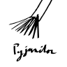

<h1 align="center">Hello 👋, I'm Logan</h1>
<h3 align="center">Software Developer | Technical Trainer | Python Enthusiast</h3>

## Areas of Expertise
- Data Science
- Machine Learning
- Teaching & Mentoring

## Technologies & Programming Languages
### Contributions
    

### Daily Use
               

### Variable Use
  
            

## Other Notable Information

<!--
**loganthomas/loganthomas** is a ✨ _special_ ✨ repository because its `README.md` (this file) appears on your GitHub profile.

Here are some ideas to get you started:

- 🔭 I’m currently working on ...
- 🌱 I’m currently learning ...
- 👯 I’m looking to collaborate on ...
- 🤔 I’m looking for help with ...
- 💬 Ask me about ...
- 📫 How to reach me: ...
- 😄 Pronouns: ...
- ⚡ Fun fact: ...
-->
